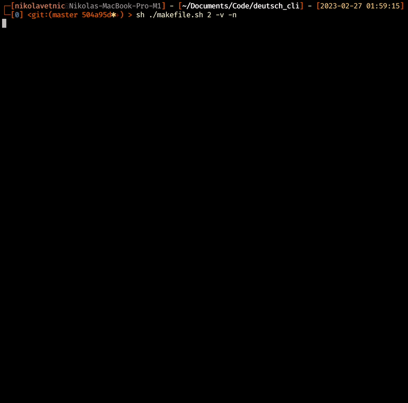

# German Test CLI Tool



German Test CLI Tool.

## Setting the Active Base File

Use the following CLI command to set the appropriate symlink - make sure to do it from within the `./base` directory:
```
	ln -s ./_complete/verbs.txt ./verbs.txt
```
